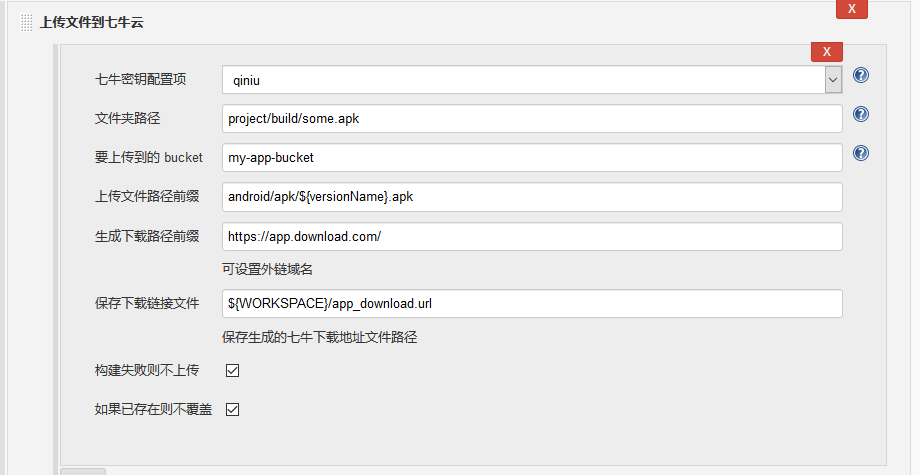

Jenkins插件--七牛云文件上传
===========

### 本插件支持以下功能

* 本地文件上传七牛云
* 添加文件路径前缀　　
* 生成文件下载链接，并存入指定文件


### 使用说明如下

1.系统管理－系统设置,添加七牛`AccessKey`和`SecertKey`。


2.在任务中添加`构建后操作`



如上图，`上传文件路径前缀`和`保存下载链接文件`支持环境变量配置。
`生成下载路径前缀`注意后面需要添加`/`，以便生成完整下载链接。

### 已经编译文件下载

[jenkins-plugin-upload-qinniu.hpi](jenkins-plugin-upload-qiniu-1.0.hpi)

### 下载源码手动编译
```
mvn package -DskipTests
```

> 项目参考[七牛云上传插件](https://github.com/onloadcc/qiniu-file), 并修复几个BUG。


